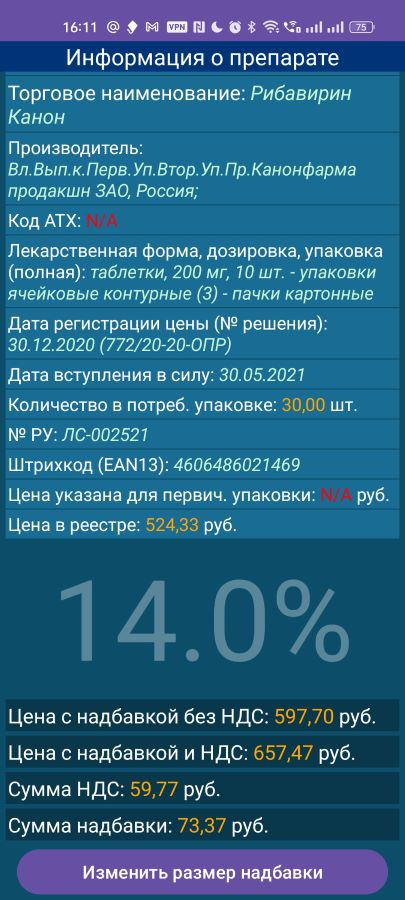

Код написан на начальном этапе изучения базового уровня Java. Не применяются библиотеки RxJava и т.п.

Приложение для удобной оффлайн работы с Государственным реестром предельных отпускных цен на лекарственные препараты. Реализованы:
- Проверка обновления файла на сайте при запуске главного экрана приложения.
- Автоматическая загрузка обновленного файла `.xlsx`.
- Проверка таблицы на отсутствие критических изменений.
- Парсинг данных в базу Room.
- Попытка реализации автоматического обновления базы по планировщику Worker (работает только на Samsung, остальные - нестабильно).
- Удобный поиск по базе данных.
- Стандартные надбавки для УРФО.
- Расчет нестандартной надбавки.

## Скриншоты

### Главный экран

### Экран результатов поиска

### Экран расчета цен

### Экран информации о базе данных

